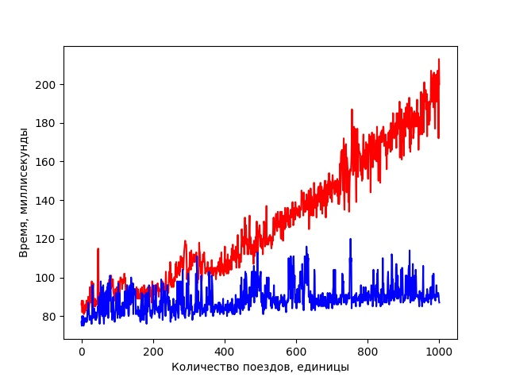
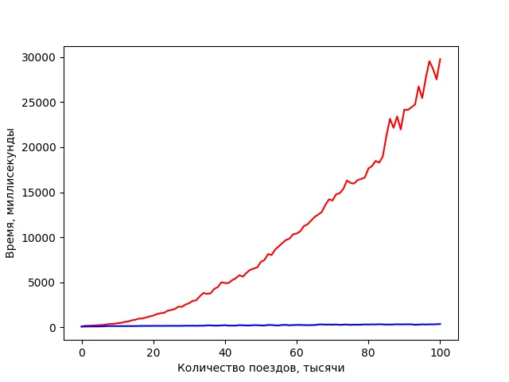

# Тестирование времени исполнения

Теоретические выкладки, предложенные ранее, могут не иметь ничего общего с реальностью.
Ниже будут предложены графики зависимости времени исполнения программы от количества
поездов во входных данных. Графики построены с использованием библиотеки
**Matplotlib** на языке пайтон при помощи [этой программы](Plotter.py). Бенчмаркинг
времени работы [тестовой программы](PerformanceTest.java) был произведён при помощи утилиты
[perf stat](http://man7.org/linux/man-pages/man1/perf-stat.1.html) в специальном 
[скрипте](test_perfomance.sh).

Параметры запуса скрипта:
 `sudo bash ./test_perfomance <название теста> <верхняя грань количества поездов> 
 <шаг количества поездов> <количество повторений одного теста>`. Если название теста начинается
 с буквы `n`, будет использован наивный алгоритм, иначе оптимальный.
 
 ### Малые значения
 *Значения запуска скрипта: граница - 1000, шаг - 1, повторения - 5.*
 
 
 Можно видеть, что уже на малых значениях n время работы наивного алгоритма
 существенно хуже времени работы оптимизированного. 
 
 ### Большие значения
 *Значения запуска скрипта: граница - 100000, шаг - 1000, повторения - 5.*
 
 
 Здесь ещё лучше видно, насколько оптимизированный алгоритм лучше наивного.